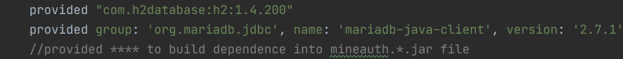

# Quick start guide

## Server side

### Environment

1. Minecraft [1.16.1,)
2. Forge [32,)
3. Java8

### Installation

1. Stop your server;
2. Download jar file, put into $MINECRAFT_SERVER_PATH/mods/ ;
3. Edit server.properties, set allow-flight=true;
4. Restart server.

## Client side

### Environment

1. Minecraft [1.16.1,)
2. Forge [32,)
3. Java8
4. Do not put mineauth.*.jar into mods/ !

### Commands

- Register: /register \<password\> \<password confirm\>
- Login: /login \<password\>
- Change password: /changePassword \<old password\> \<new password\> \<password confirm\>
- Forge: /forgetPassword
- Set identifying: /identifierSet \<identifier\>
- Reset password(op only): /resetPassword \<userName\>

# Localization

- Put your own i18n file into $MINECRAFT_SERVER_PATH/mineauth/i18n/ , Rename it to
  xxx.json([File example](src/main/resources/assets/mineauth/json/i18n)), And edit
  $MINECRAFT_SERVER_PATH/world/serverconfig/mineauth-server.toml.

# Configuration

## path

$MINECRAFT_SERVER_PATH/world/serverconfig/mineauth-server.toml

## example

```toml

#Server configuration
[server]
#Enable or disable account auth module
enableAccountModule = true
#Enable or disable latch module
enableLatchModule = false
#language for message(en-US,zh-CN)
language = "en-US"
#Enable or disable banner on console
enableBanner = false

#database configuration
[database]
#Column for the identifier
columnIdentifier = "EMAIL"
#Column telling whether the player is banned
columnBan = "BANNED"
#Column telling whether the player last login time
columnLastLogin = "LAST_LOGIN"
#Column for the username
colummUsername = "USERNAME"
#Column for UUID
colummUuid = "UUID"
#Column for the encrypted password
columnPassword = "PASSWORD"
#Server hosting the database(within a clearly schema)
url = "jdbc:h2:file:./mineauth/internalDatabase;SCHEMA=MINEAUTH;AUTO_SERVER=TRUE;AUTO_RECONNECT=TRUE"
#JDBC driver to use("org.h2.Driver" for h2 database,"org.mariadb.jdbc.Driver" for mysql/mariadb)
driver = "org.h2.Driver"
#Database user
user = "root"
#Database password
password = "admin"
#Table to be used
table = "PLAYERS"
#PoolSize to be used
#Range: 1 ~ 10
poolSize = 2

#account module configuration
[account]
#Enable or disable the /register command.
enableRegister = true
#Enable or disable the /changePassword command.
enableChangePassword = true
#Delay in seconds a player can authenticate before being automatically kicked from the server.
#Range: 30 ~ 600
delay = 60
#ResetPassword will set player's password as it.
defaultPassword = "Abc123"

```

## Modify Database

- Mineauth allows h2 database and mysql/mariadb to save player, to modify database settings, you can edit
  mineauth-server.toml;
- In case of other database, you can clone this repository, add your database driver into [build.gradle](build.gradle)(
  just like following), compile it, and get your own mineauth.*.jar.



- References to create table:

```sql
create schema MINEAUTH;
create table PLAYERS
(
    `ID`         VARCHAR(36) not null
        primary key,
    `USERNAME`   VARCHAR(40),
    `UUID`       VARCHAR(40) not null,
    `EMAIL`      VARCHAR(40),
    `BANNED`     VARCHAR(5),
    `PASSWORD`   VARCHAR(40) not null,
    `LAST_LOGIN` TIMESTAMP
);
``` 

# External account management support

## Database

- Mineauth allows ordinary databases(h2,mysql), you can use your own program to manipulate the database.

## Forget password solution

- ForgetPassword command will write the message to $MINECRAFT_SERVER_PATH/mineauth/forget.txt(TIMESTAMP|player's
  UUID|player's name|player's identification), you can use your own program to read it.